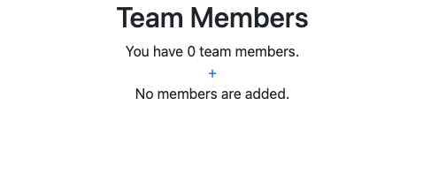
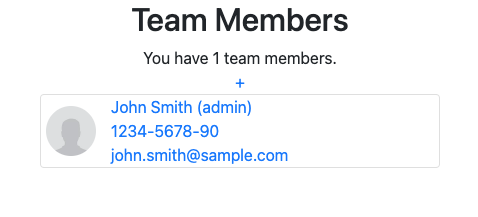
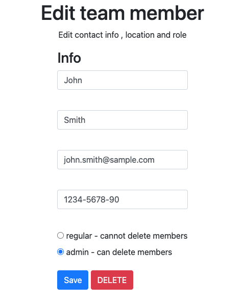

# team_manager
Project by Instawork<br>
This application manages the list of the teammanager.<br>
You can add/edit/delete team members.<br>
Team member data is saved in SQLite database.<br>

Click + sign to start adding a team member.


Fill out all the fields and click save.


You will redirect to the home page.


Click the existing member to edit or delete the member.


## Prerequisites
1. install python
    
## How to run the project
1. Migrate SQLite database
   ```
   python3 manage.py migrate
   ```
1. Run the server
    ```
    python3 manage.py runserver
    ```
    
    The server is running on http://localhost:8000/teammanager
    
## How to run a test
```
python3 manage.py test teammanager
```
