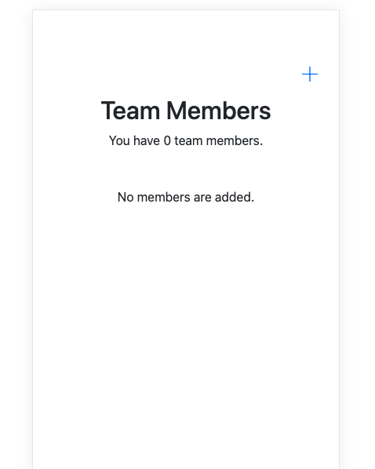
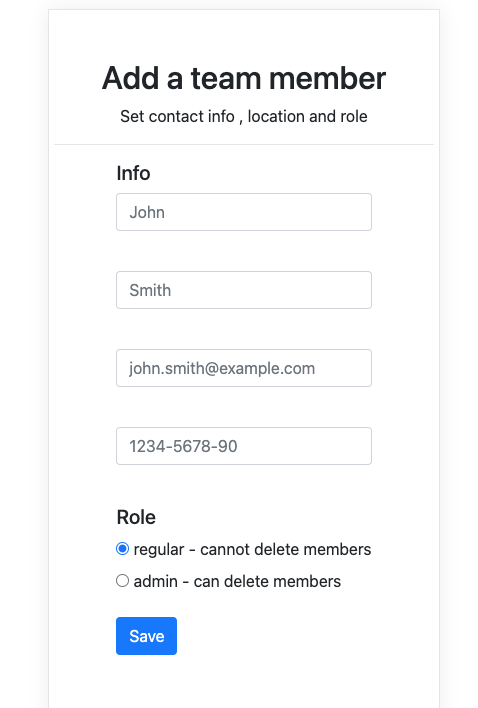
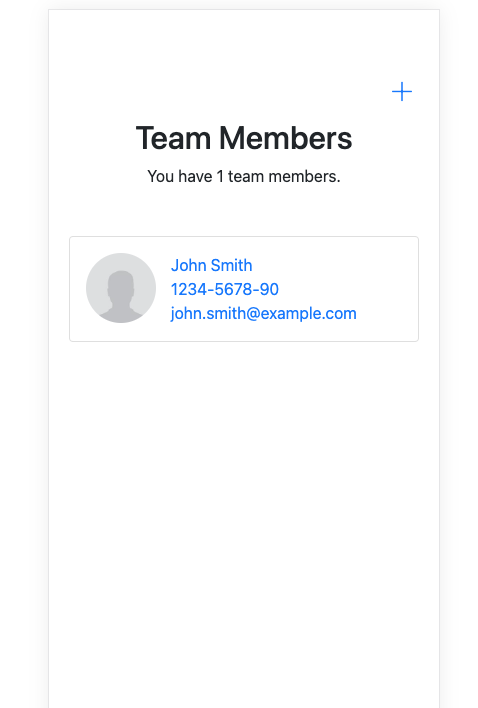
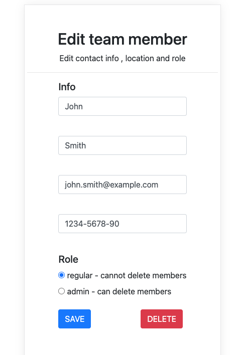

# team_manager
Project by Instawork<br>
This application manages the list of the teammanager.<br>
You can add/edit/delete team members.<br>
Team member data is saved in SQLite database.<br>

1. Click + sign to start adding a team member.<br>



2. Fill out all the fields and click save.<br>



You will be redirected to the home page.<br>



3. Click the existing member to edit or delete the member.<br>




## Prerequisites
1. install python
2. install pip
3. install django
    ```python3 -m pip install Django```
    
## How to run the project
1. Migrate SQLite database
   ```
   python3 manage.py migrate
   ```
1. Run the server
    ```
    python3 manage.py runserver
    ```
    
    The server is running on http://localhost:8000/teammanager
    
## How to run a test
```
python3 manage.py test teammanager
```

test file is located in
```team_manager/teammanager/tests.py```
